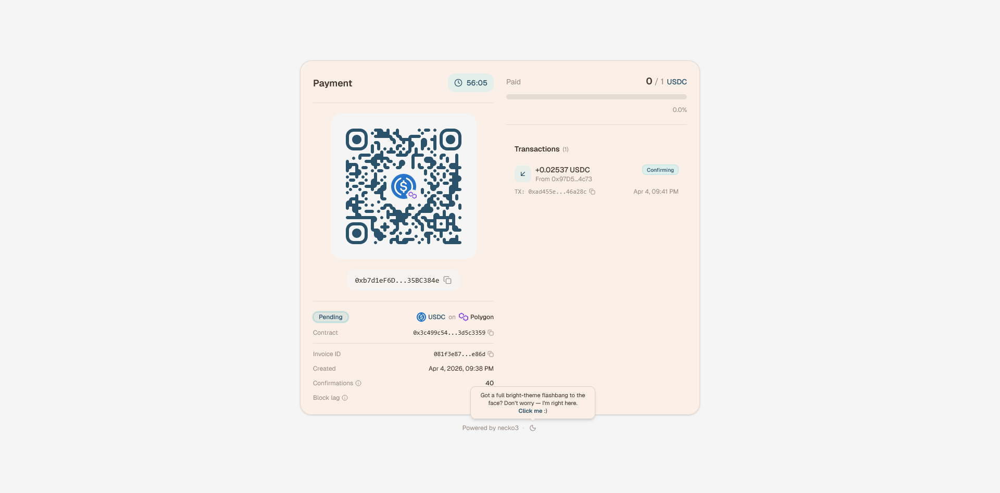
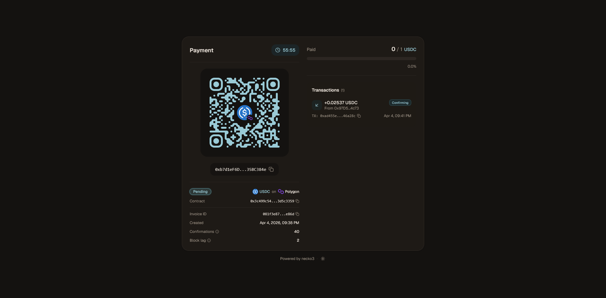
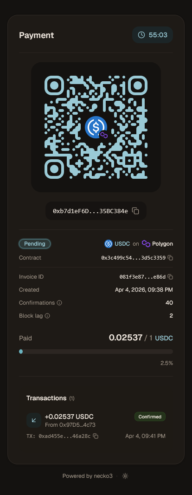
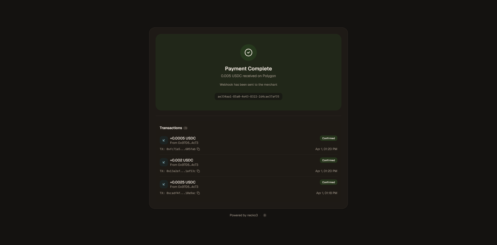
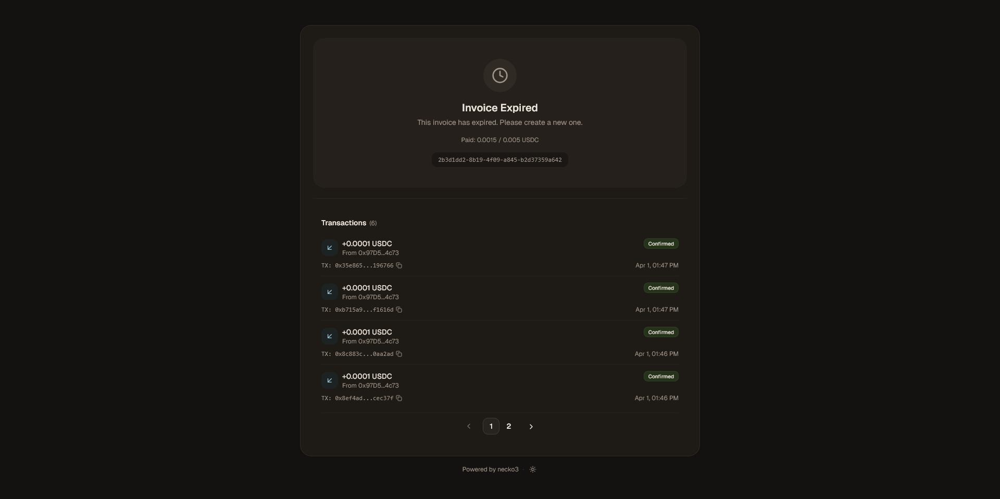
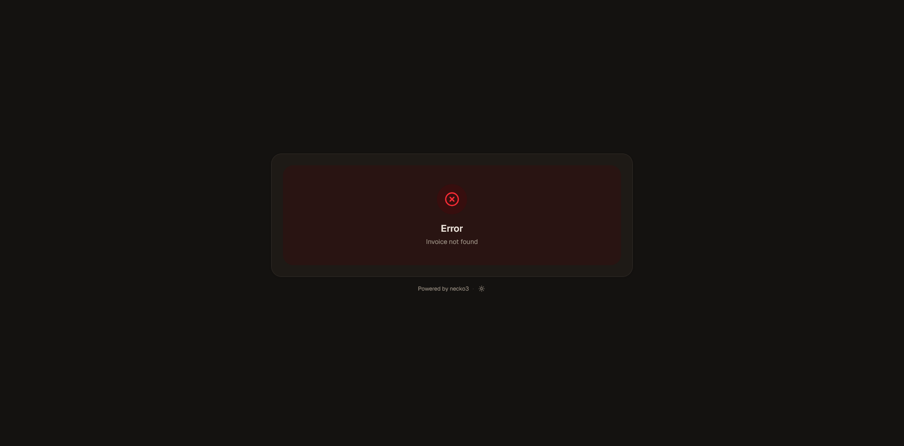
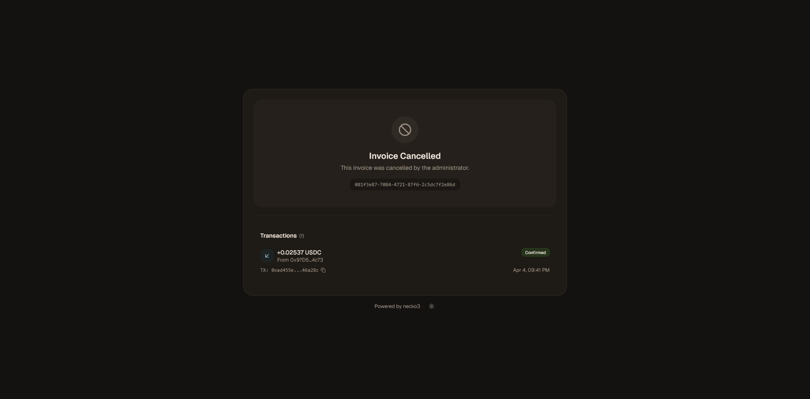

<div align="center">
  <a href="https://github.com/necko-moe/necko3-payment-page">
    
  </a>
  <h1>necko3-payment-page</h1>

  <a href="https://github.com/necko-moe/necko3-payment-page/stargazers">
    
  </a>
</div>

***

## About

**necko3-payment-page** is the customer-facing half of the [necko3](https://github.com/necko-moe) project — the page your users actually see when they click a payment link. It talks to the public endpoints of [necko3-backend](https://github.com/necko-moe/necko3-backend) _(no API key, no auth, no secrets anywhere near the browser)_ and guides the payer from "here's a QR code" to "your payment is confirmed" without a single page reload.

One route. One job. Open `/{invoiceId}`, scan the code or copy the address, send crypto, watch the progress bar fill up. Once the required confirmations are in, she shows a success screen and the merchant gets a webhook. That's it. No account creation, no sign-up forms, no "please verify your email" nonsense.

The whole thing is a static SPA — build it, throw the output behind any web server, and she takes it from there. The Docker image ships with nginx that proxies `/api/` to your backend, so the browser never needs to know where the real API lives.

If you're looking for the admin panel where you configure chains, create invoices, and inspect webhooks, that's [necko3-frontend](https://github.com/necko-moe/necko3-frontend). This repo is strictly what your customers see.

<div align="center">
  <table>
    <tr>
      <td></td>
      <td></td>
    </tr>
  </table>
</div>

### Features

- **Real-time polling** — invoice and payment data refresh every second. The moment a transaction hits the mempool, it shows up. Polling auto-stops once the invoice reaches a terminal state _(Paid, Expired, Cancelled)_, because hammering your backend after the job is done would be rude. (The transition to web sockets will happen as soon as I implement this on the backend)
- **Branded QR codes** — generated with `qr-code-styling`, themed to match dark/light mode, with a composited center image showing the token logo and chain badge. Looks good enough to screenshot and send to your mom.
- **Live countdown timer** — ticks down to `expires_at` every second. Goes red and urgent under one minute, because nothing motivates a crypto transfer like a ticking clock.
- **Payment progress** — a progress bar showing paid vs. total with BigInt-safe decimal formatting _(no floating-point rounding surprises on large amounts)_.
- **Paginated transaction list** — every payment attempt with amount, sender address, tx hash (click to copy), status badge, and timestamp. Paginated at 4 per page because nobody wants to scroll through 47 dust attacks.
- **Chain & token agnostic** — the UI doesn't hardcode any network or token. Whatever your backend exposes through the public chain/token endpoints, the payment page will render it — logos, decimals, contract addresses, confirmation thresholds, all of it.
- **Dark / light theme** — persisted in `localStorage`, applied before first paint via an inline script in `index.html` _(no white flash of death)_. Toggle lives in the page header.
- **Fully responsive** — two-column grid on desktop, single column on mobile. Works on everything from an iPhone SE to whatever ultrawide monitor you're compensating with.
- **Static build output** — deploy anywhere: Nginx, Caddy, S3, a Raspberry Pi, your grandma's NAS. If it can serve HTML, it can run this.

## Screenshots

<div align="center">
  <table>
    <tr>
      <td></td>
      <td></td>
    </tr>
    <tr>
      <td></td>
      <td></td>
    </tr>
    <tr>
      <td></td>
      <td></td>
    </tr>
  </table>
</div>

## Tech Stack

| Layer | What |
|-------|------|
| UI | React 19, TypeScript 5.9 |
| Build | Vite 8 |
| Styling | Tailwind CSS 4 |
| Components | shadcn/ui + Radix UI |
| Routing | react-router 7 |
| QR | qr-code-styling |
| Fonts & Icons | Geist, Lucide |
| Toasts | Sonner |

## How It Works

1. Merchant creates an invoice via the [admin panel](https://github.com/necko-moe/necko3-frontend) or the backend API directly. The invoice comes with a payment link: `https://your-payment-page.example/{invoiceId}`.
2. Customer opens the link. The page fetches the invoice from `GET /public/invoice/:id` and loads chain/token metadata in parallel.
3. A QR code with the deposit address is displayed alongside the amount, token, network, countdown timer, and confirmation requirements.
4. The customer sends crypto. The page polls every second — the moment a transaction is detected, it appears in the payments list with a `Confirming` badge.
5. Once enough confirmations roll in, the invoice flips to `Paid`, the page shows a success screen, and the merchant receives a webhook. Done.

If the timer runs out before full payment, the page shows an `Expired` screen. If the merchant cancels the invoice, it shows `Cancelled`. In both cases, any existing transactions are still displayed below the status for reference.

## Public API Endpoints

The payment page consumes only **public** backend endpoints — no API key required:

| Endpoint | Purpose |
|----------|---------|
| `GET /public/invoice/:id` | Invoice details (amount, address, status, expiry) |
| `GET /public/invoice/:id/payments?page=&page_size=` | Paginated payment attempts for the invoice |
| `GET /public/chain/:name` | Chain metadata (confirmations, block lag, decimals, logo) |
| `GET /public/chain/:name/token/:symbol` | Token metadata (contract, decimals, logo) |

## Installing and Launching

### 1. Preparation

Make sure Docker is installed, then grab the compose file:
```bash
# Install Docker if not already installed
sudo curl -fsSL https://get.docker.com | sh

# Create working directory
mkdir /opt/necko3-payment-page && cd /opt/necko3-payment-page

# Grab the compose file
curl -o docker-compose.yml https://raw.githubusercontent.com/necko-moe/necko3-payment-page/refs/heads/main/docker-compose.yml
```

### 2. Configuration (.env)

```bash
curl -o .env https://raw.githubusercontent.com/necko-moe/necko3-payment-page/refs/heads/main/.env.example
```

Open `.env` and fill in one value:

| Variable | Description |
|----------|-------------|
| `BACKEND_URL` | Full URL to your [necko3-backend](https://github.com/necko-moe/necko3-backend) instance (e.g. `https://api.necko.moe`). The nginx proxy inside the container forwards `/api/` requests here. |

### 3. Launch

```bash
docker compose up -d && docker compose logs -f -t
```

The payment page will be available on `127.0.0.1:3737`.

### 4. TLS / Reverse Proxy

The container binds to **localhost only** — it does not expose itself to the internet by default. Set up a reverse proxy (Nginx, Caddy, Traefik — whatever your soul desires) with TLS certificates pointing to `127.0.0.1:3737`.

Or just expose the port to the world if plaintext HTTP and the total absence of encryption don't bother you _(please let them bother you)_.

<details>
<summary>What the <code>docker-compose.yml</code> looks like</summary>

```yaml
services:
  payment-page:
    image: ghcr.io/necko-moe/necko3-payment-page:latest
    container_name: necko3-payment-page
    restart: unless-stopped
    env_file: .env
    ports:
      - "127.0.0.1:3737:80"
```
</details>

## Development

If you want to hack on the UI or just enjoy `npm run dev` more than Docker:

```bash
git clone https://github.com/necko-moe/necko3-payment-page.git
cd necko3-payment-page
npm install

cp .env.example .env
nano .env # Rename BACKEND_URL to VITE_API_URL and point it at your backend

npm run dev
```

Dev server starts on `http://localhost:5173`. To produce a production build:

```bash
npm run build
```

Static output lands in `dist/` — serve it however you like.

## Contributing

I'd be happy to see any feedback.<br />
Found a bug? <a href=https://github.com/necko-moe/necko3-payment-page/issues/new>Open an Issue</a>.<br />
Want to add a feature? Fork it and send a PR.

## License

The project and all repositories are distributed under the **MIT License**. Feel free to use, modify, and distribute <3

* * *

<div align="center">
  <h1>SUPPORT PROJECT</h1>
  <p>Want to make necko1 employed or donate enough for a Triple Whopper? Contact me -> <a href=https://t.me/everyonehio>Telegram</a> or <a href="mailto:meow@necko.moe">Mail me</a> (I rarely check that). I don't accept direct card transfers, just so you know</p>
  <p>
    Broke but still want to help?
    You can just <a href="https://github.com/necko-moe/necko3-payment-page/stargazers"><b>⭐ Star this repo</b></a> to show your love. It really helps!
  </p>
  <a href="https://github.com/necko-moe">
    
  </a>
</div>
